# Troubleshooting and debugging

## Add your data sources

### Prometheus metrics data source

1. Go to **Configuration > Data Sources** in the left menu, then click **Add data source**.
  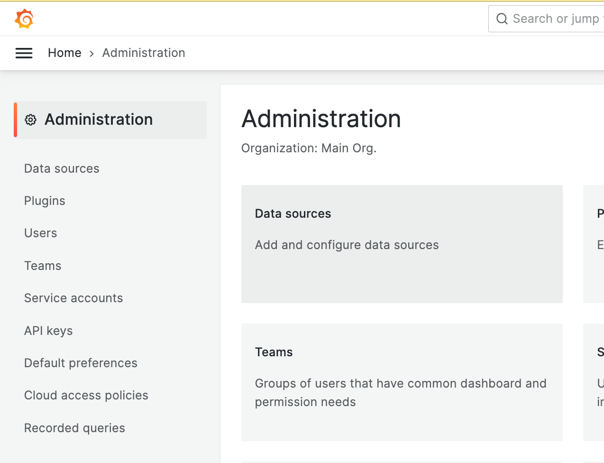
  
1. Add a new Prometheus data source with the following settings:
  - Name: `PromCorrelation-<your-initials>`
  - Enter URL: `http://prometheus:9090`
<!---  - Enable the basic auth toggle 
  - Enter Username: `REPLACE`, Password: `REPLACE` --->
1. Click **Save and Test**.
    
    

### Jaeger tracing data source

1. Add a new Jaeger data source with the following settings:
  - Name: `JaegerCorrelation-<your-initials>`
  - Enter URL: `http://jaeger:16686`
<!---   - Enable the basic auth toggle
  - Enter Username: `REPLACE`, Password:`REPLACE` --->
1. Click **Save and Test**.
  
  

### Loki logs data source

1. Add a new Loki data source with the following settings:
  
  
  - Name: `LokiCorrelation-<your-initials>`
  - Enter URL: `http://loki:3100`
  
<!---   - Enable the basic auth toggle
  - Enter Username: REPLACE, Password: REPLACE --->
1. Configure to use Jaeger for visualising the traces with the Derived fields functionality. Scroll down to see the fields:
      - Name: TraceId
      - Regex: `.*trace_id=(.*?)\s.*`  
      - Query: `${__value.raw}`
      - Enable the internal link and select the Jaeger service
  - Click `Save and Test`
  
  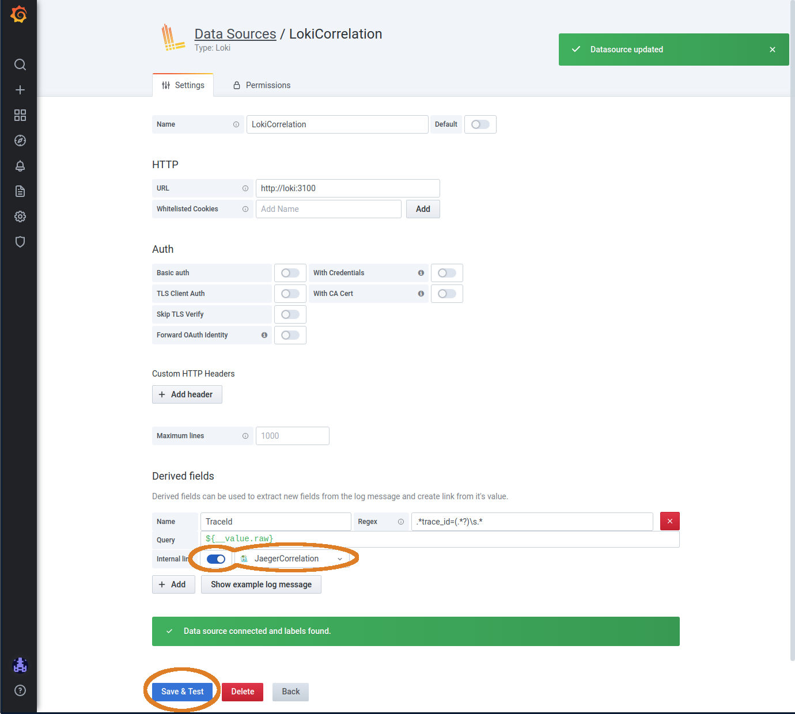

1. Click **Save and Test**.

## Write your first Loki queries in the Grafana Explore view

Filter logs using Loki label queries:
1. Go to Explore in the left menu, and make sure you have the `LokiCorrelation` selected in the upper left corner, with the logs view selected.
   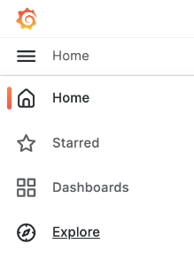
    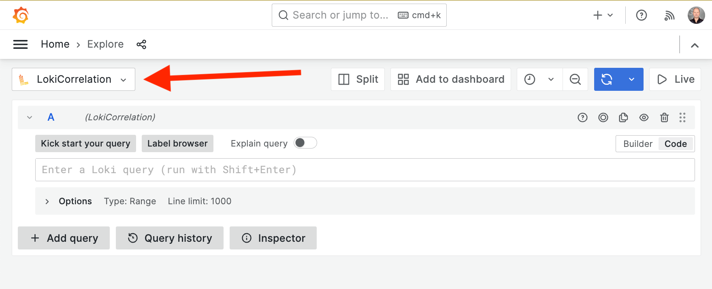
1. Select the `{service="web_app_3"}` log label from the Log Labels dropdown, which is positioned  left of the query input box. 
  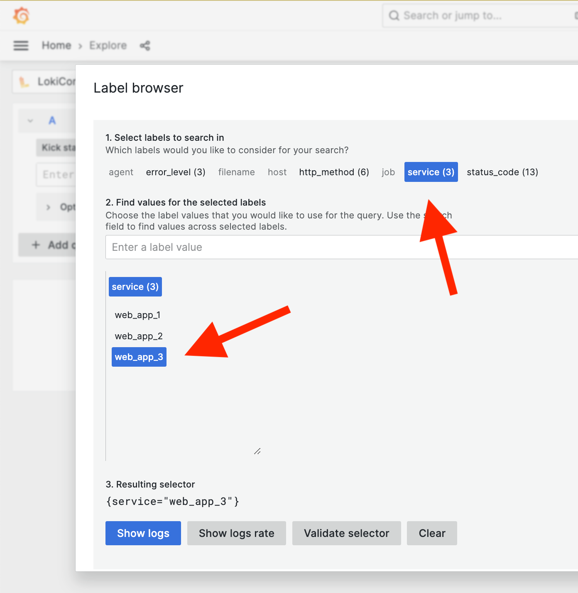
1. Click on one of the returned log lines to see its row detail view. If you don’t see enough rows, zoom out the time range using the magnifying glass icon in the right upper corner.
  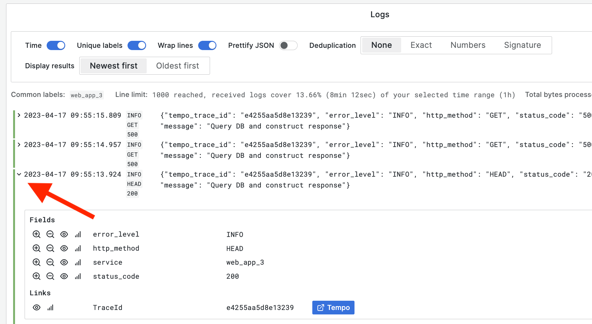

1. Filter your logs down using filter expressions, try out by pasting the below queries and press shift-enter to run them.
    - All log lines that contain `favicon.ico`:  `{service="web_app_3"} |= "favicon.ico"`
    - All log lines that don’t contain a `200` value: `{service="web_app_3"} != "200"`
    - All log lines that contain the 5xx value: `{service="web_app_3"} |~ "5\\d{2}"`
     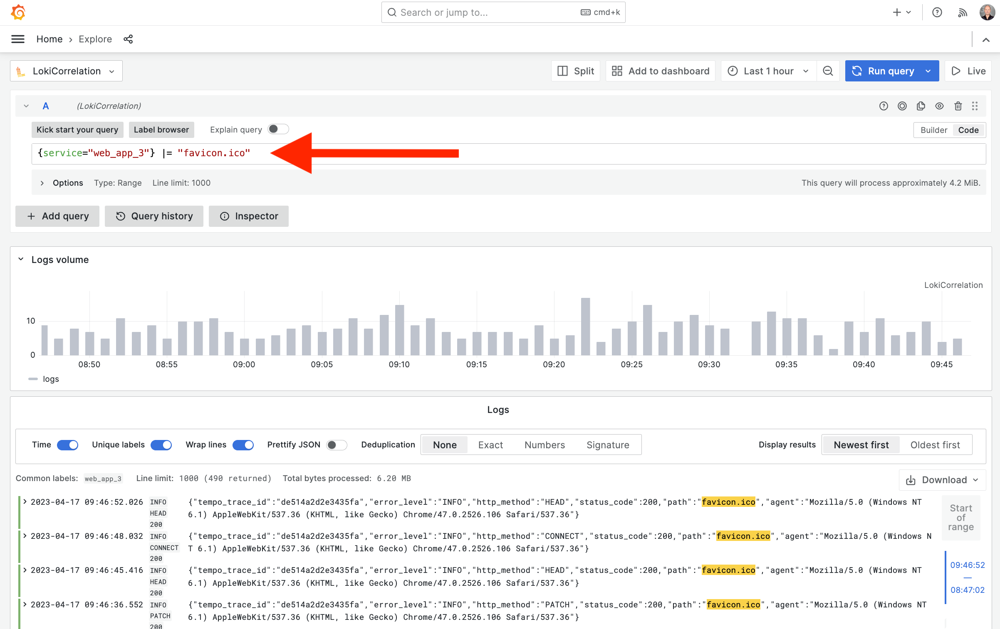
1. Turn on live tailing (upper right Live button) on one of these queries and view the logs as they are received by Loki, and filtered by the query.
1. Switch to metrics mode and start graphing logs counts with Range Vectors Aggregations, try out by pasting the below queries and press shift-enter to run them.
1. Graph the log line count for any web_app service with an 5xx category status code AND contains Mozilla for every 5 minute interval `sum by (service) (count_over_time({ service=~"web_app_.+", status_code=~"5\\d{2}" } |~ "Mozilla.*" [5m]))`

## Correlate metrics, logs, and traces

Finding suspect patterns in Prometheus metrics
1. Open the PromCorrelation datasource in the Explore view (left upper corner).
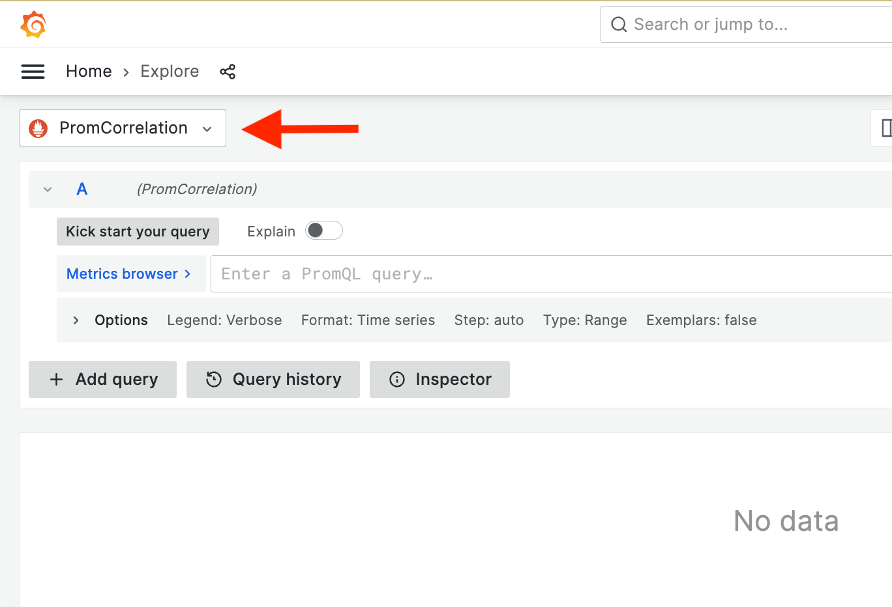
1. Select from the metrics picker `web` > `web_http_requests`.
1. Make sure the time picker (right upper corner, clock icon) is set to last 5 minutes.
   - Notice the three series, each charting the amount of concurrent users over time. 
1. Filter down on the suspect service, `web_app_3`, by changing adding a label filter and press `shift-enter` to run: `web_http_requests{service="web_app_3"}`
  - Notice the suspect 'saw pattern', let’s find out what’s causing the steep drop in concurrent users requests.

Correlating your prometheus metrics with your Loki metrics
1. Click the split button next to the time picker.
  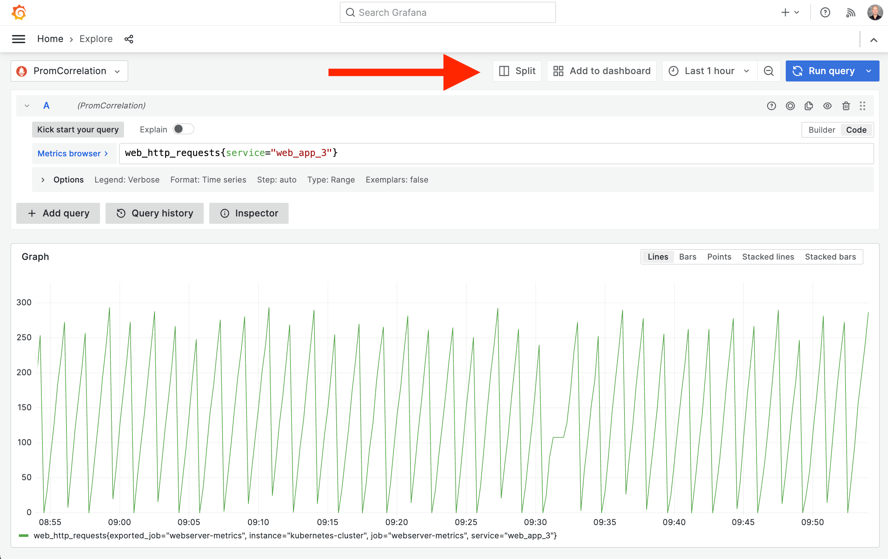
1. The new (right) panel shows the same Prometheus query, change the data source selection on that panel to our LokiCorrelation data source. 
  - Notice that it will recognize the label selection of Prometheus, and apply it to your Loki logs, so you get the latest relevant logs right away.
1. Click the chain button next to the time picker to sync up the time range of both views.

1. Select in the prometheus graph the timerange where the drop happened.
  - Notice the Loki panel timerange also shows the logs of that time range. 
1. If you have a lot of log lines, filter on the errors by clicking on the error label on the histogram.

  - You should see a log line with out of memory, which hints at a memory leak being the reason of the drop in concurrent users.

## Correlate metrics, logs and traces

- Besides outages, it’s also common to have latency issues for which traces allows us to find the bottleneck in complex request/response flows. 
 - Zoom out the time range until you have log lines that start with a `Trace ID`
 - Click on a log line with a `Trace ID`
   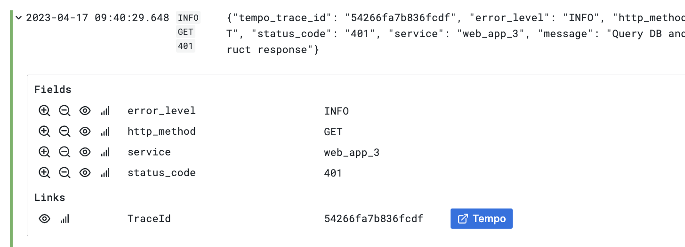
 - In the parse fields, you should have a Jaeger button next to the parsed `Trace Id` value.
  - Click on it, and you can now inspect the trace in the new Grafana 7 Trace View and understand any possible bottlenecks in the request/response flow of your service.
    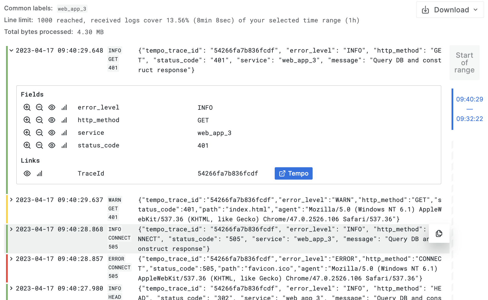

